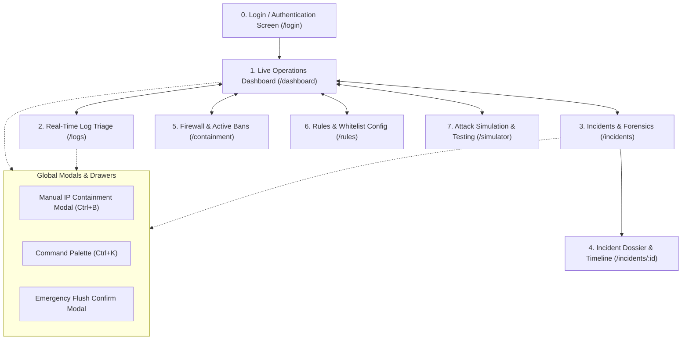

# Application Flow & UX Architecture Document

**Project Name:** SentinelBash — Mini-SOC Automation & Incident Response Console  
**Document Version:** 1.0.0  
**Status:** Approved for Frontend Engineering & Implementation  
**Role:** Principal UX Strategist & Security Product Designer  
**Companion Documents:** [PRD.md](file:///d:/SOC%20Automation/PRD.md) | [TRD.md](file:///d:/SOC%20Automation/TRD.md)  

---

## 1. Information Architecture & Navigation Model

### 1.1 Global Site Hierarchy



### 1.2 Global Shell & Layout Structure
Every authenticated page renders inside a responsive dark-mode shell:
- **Left Persistent Sidebar (Desktop 260px wide, Collapsible on Mobile):**
  - Brand Header: `[Shield-Icon] SentinelBash` with a pulsing green connection indicator.
  - Primary Navigation links with active route indicator.
  - Daemon Status Chip: `Engine: Active | Netfilter: OK`.
  - User profile / Logout trigger at bottom.
- **Top Utility Header (Height 64px):**
  - Breadcrumbs navigation (`Sentinel / Incidents / INC-20260919-8F32`).
  - Search trigger / Command Palette input (`Ctrl+K`).
  - Emergency Action Button: `[+ Quarentine IP]`.
  - Engine Stream Toggle: `[Live Stream ● ON/PAUSED]`.
  - Notification Bell with unread badge count.
- **Main Viewport Content Area:**
  - Dynamic page view with smooth transitions, container max-width `1600px`.
- **Global Toast Container (`#toast-container`):** Fixed bottom-right notification stack.

---

## 2. Design System Tokens & Style Palette

| Token Category | Token Name | Value | Usage |
| :--- | :--- | :--- | :--- |
| **Canvas & Surfaces** | `--bg-canvas` | `#0B0F17` (Deep Obsidian) | Root body background |
| | `--bg-surface` | `#111827` (Charcoal Slate) | Cards, panels, tables, modals |
| | `--bg-surface-elevated`| `#1F2937` | Hover states, active inputs, dropdowns |
| | `--border-subtle` | `#374151` | Dividers, card borders, table row borders |
| **Accent / Cyber** | `--accent-cyan` | `#06B6D4` (Cyan Glow) | Active states, primary indicators, charts |
| | `--accent-cyan-glow` | `rgba(6, 182, 212, 0.15)` | Glowing box-shadows and pill backgrounds |
| **Status / Severity** | `--color-critical` | `#EF4444` (Crimson) | Auto-blocked IPs, SSH Brute Force, Errors |
| | `--color-high` | `#F59E0B` (Amber) | Web scans, privilege escalation alerts |
| | `--color-medium` | `#3B82F6` (Electric Blue)| System events, rule reloads |
| | `--color-low/safe` | `#10B981` (Emerald) | Whitelisted, unbanned, engine healthy |
| **Typography** | Font Family | `Inter, -apple-system, sans-serif` | Clean UI body copy |
| | Code / Monospace | `JetBrains Mono, monospace` | IP addresses, log lines, raw commands |

---

## 3. Detailed Screen-by-Screen Specifications

---

### Screen 1: Authentication Screen (`/login`)

#### 1. Purpose & Layout
Single-purpose, centered card (`max-w-md`) over a subtle animated cybersecurity grid background. Authenticates SOC operators and sets the session JWT.

```text
+-------------------------------------------------------+
|                   [Shield-Icon]                       |
|                   SENTINEL BASH                       |
|               SOC Security Gateway                    |
|                                                       |
|  Operator API Key or Password                         |
|  [ ************************************ ]             |
|                                                       |
|  [ Remember session on this workstation [x] ]         |
|                                                       |
|  [        AUTHENTICATE TO CONSOLE (Enter)       ]     |
|                                                       |
|  Host: ip-10-0-1-5 | Kernel Netfilter: Ready          |
+-------------------------------------------------------+
```

#### 2. Elements & IDs
- `#login-input-key`: Password field with eye-toggle for revealing token.
- `#login-btn-submit`: Primary call-to-action with cyber-cyan glow.
- `#login-error-banner`: Hidden by default; displays authentication failures.

#### 3. User Actions & Button Behavior
- **Action:** Operator enters API Token or Master Password and clicks `#login-btn-submit` (or presses `Enter`).
- **Behavior:**
  1. Button transitions to loading state: Spinner displays, label changes to `"Verifying Credentials..."`, button disables.
  2. Submits `POST /api/v1/auth/token` with `{ "token": "<value>" }`.
- **Success State:**
  - Receives `200 OK` with `{ "access_token": "...", "expires_in": 28800 }`.
  - Token stored in `sessionStorage` (or `localStorage` if "Remember session" checked).
  - Instant redirect to `/dashboard` with welcoming toast: `"Authenticated as SOC Operator"`.
- **Error State:**
  - On `401 Unauthorized`: Button reverts to active state with brief shake animation.
  - `#login-error-banner` slides down in red: `"Invalid Operator Key. Check /etc/sentinel/jwt.secret on host."`
- **Empty State:**
  - Submit button is disabled (`opacity-50 cursor-not-allowed`) until at least 8 characters are entered.

---

### Screen 2: Live Operations Dashboard (`/dashboard`)

#### 1. Purpose & Layout
The command center. High-density, real-time overview of current host security posture, threat frequency charts, active netfilter quarantines, and quick-action triggers.

```text
+---------------------------------------------------------------------------------------------------+
| Top Metric Row:                                                                                   |
| [ MTTD: 1.4s ]  [ Active Bans: 8 ]  [ Threats Past 24h: 142 ]  [ Engine Health: 100% (0 errors) ]  |
+---------------------------------------------------------------------------------------------------+
| Left Column (60%):                                | Right Column (40%):                           |
| [ Real-Time Threat Ingestion Feed (Live SSE)   ]  | [ Active Firewall Quarantine Table          ] |
|   11:20:12 203.0.113.45 SSH Brute Force [BLOCK]   |   IP             Threat   Expires   Action    |
|   11:20:15 198.51.100.2 Dir Traversal   [BLOCK]   |   203.0.113.45   SSH      52m left  [Unban]   |
|   11:20:22 192.168.1.50 Failed Login   [BYPASS]  |   198.51.100.2   Nginx    1h 12m    [Unban]   |
|                                                   |   [ View All 8 Quarantined Targets -> ]       |
| [ Attack Vector Breakdown Chart                ]  +-----------------------------------------------+
|   SSH (74%) | Web Recon (21%) | Sudo (5%)         | [ Quick Simulation Launcher                 ] |
|                                                   |   [ Simulate SSH Attack ] [ Test Web Scan ]   |
+---------------------------------------------------------------------------------------------------+
```

#### 2. Elements & IDs
- `#stat-mttd`: Metric card displaying average Mean Time to Detect.
- `#stat-active-bans`: Metric card displaying active iptables drop rules.
- `#stat-threats-24h`: Count of automated threat triggers over the last 24 hours.
- `#feed-live-events`: Auto-scrolling, high-performance container displaying newly parsed security incidents.
- `#table-active-bans-preview`: Compact 5-row table of currently blocked IPs.
- `#btn-quick-unban-{ip}`: Inline button in table to quickly revoke firewall block.
- `#btn-launch-sim-ssh`: One-click button to trigger a safe SSH test attack simulation.

#### 3. User Actions & Button Behavior
- **Click `#btn-quick-unban-{ip}`:**
  - Displays mini confirmation popover: `"Confirm unban for 203.0.113.45?"`.
  - On confirm: Emits `POST /api/v1/containment/unban` with `{ "ip": "..." }`.
  - Row fades out with green highlight. Active ban count decrements in real time.
- **Click `#btn-launch-sim-ssh`:**
  - Triggers `POST /api/v1/simulate` with `{ "type": "ssh_brute_force" }`.
  - Feed animates with incoming simulated events within 1.5s, verifying system health.
- **Success State:**
  - Real-time events append to `#feed-live-events` with a glowing border animation (`fade-in-slide-down`).
- **Error State:**
  - If SSE stream disconnects: Top banner turns amber `#banner-sse-lost`: `"Connection to Sentinel Daemon lost. Retrying in 3s... [Reconnect Now]"`.
- **Empty State:**
  - If Active Bans = 0: `#table-active-bans-preview` shows a clean shield illustration: `"Zero active quarantine rules. Host perimeter is clear."`

---

### Screen 3: Real-Time Log Triage & Stream (`/logs`)

#### 1. Purpose & Layout
A high-throughput, raw and normalized log streaming interface designed for SOC tier-1 triage. Emulates an enhanced `tail -F` with search, regex filtering, pause/play buffer, and one-click quarantine.

```text
+---------------------------------------------------------------------------------------------------+
| Controls: [ Search Regex: /.*Failed password.*/i      ] [ Service: All v ] [ Status: All v ]     |
| Stream:   [ [II] Pause Stream ] [ Clear Console ] [ Autoscroll: ON ]  [ Ingest Rate: 14 lines/sec ]|
+---------------------------------------------------------------------------------------------------+
| 11:21:01.402  AUTH   sshd[29812]  Failed password for invalid user admin from 198.51.100.99  [Ban]|
| 11:21:02.115  AUTH   sshd[29814]  Failed password for invalid user root from 198.51.100.99   [Ban]|
| 11:21:02.990  NGINX  access.log   404 GET /phpmyadmin/index.php from 203.0.113.88            [Ban]|
| 11:21:03.540  AUTH   sshd[29820]  Accepted publickey for ubuntu from 192.168.1.10 [SAFE]          |
| 11:21:04.102  AUTH   sshd[29825]  Failed password for invalid user test from 198.51.100.99   [Ban]|
+---------------------------------------------------------------------------------------------------+
| Quick Inspector Drawer (opens on row click):                                                      |
| Selected IP: 198.51.100.99 | Geo: Frankfurt, DE | Attempts: 12 in 30s | [ Instant Firewall Drop ] |
+---------------------------------------------------------------------------------------------------+
```

#### 2. Elements & IDs
- `#input-log-search`: Real-time text/regex filter input.
- `#select-log-service`: Dropdown filter (`All`, `SSH / auth.log`, `Nginx / access.log`, `Syslog`).
- `#btn-stream-pause`: Toggles between `[Pause Stream]` and `[Resume Stream]`.
- `#btn-stream-clear`: Clears local log buffer window.
- `#container-log-terminal`: Monospace, dark-themed virtualized scrolling list.
- `#drawer-log-inspect`: Slide-over drawer detailing selected log line and IP context.
- `#btn-drawer-quarantine`: Button inside drawer to immediately quarantine inspected IP.

#### 3. User Actions & Button Behavior
- **Press Spacebar or Click `#btn-stream-pause`:**
  - Pauses rendering to the DOM while holding incoming events in an in-memory queue (max 5,000 items).
  - Floating pill appears: `"Stream Paused (48 new lines buffered) - [Click to Resume]"`.
- **Click on any Log Row:**
  - Row highlights in cyan border.
  - `#drawer-log-inspect` slides in from right with full parsed JSON payload, surrounding log lines, and IP reputation summary.
- **Click `#btn-drawer-quarantine`:**
  - Prompts confirmation modal with default 3600s ban duration.
- **Success State:**
  - Incoming matching log lines stream smoothly at up to 250 lines/second without browser thread lag (using `requestAnimationFrame` batching).
- **Error State:**
  - Invalid regex in search bar: Input border turns red, tooltip displays `"Invalid Regex Syntax"`, filtering gracefully defaults to literal substring match.
- **Empty State:**
  - When filter yields 0 matches: Terminal displays: `"No log lines match the filter 'admin'. Reset filters or wait for new incoming events."` with a `[Reset Filter]` button.

---

### Screen 4: Incidents & Forensics Hub (`/incidents`)

#### 1. Purpose & Layout
Comprehensive repository of all historical detection events, containment actions, and investigation dossiers. Supports filtering by threat type, status, and date range.

```text
+---------------------------------------------------------------------------------------------------+
| Filters: [ Threat Type: All v ] [ Status: All v ] [ Search IP / ID: ...     ] [ Export CSV / JSON]|
+---------------------------------------------------------------------------------------------------+
| Incident ID        Timestamp         Attacker IP      Threat Type        Threshold  Status  Action|
| INC-20260919-8F32  11:20:12 (3m ago) 203.0.113.45     SSH Brute Force    5 fails/60s [CONTAINED] [>] |
| INC-20260919-7A19  10:45:01 (38m ago)198.51.100.2     Web Path Traversal 8 probes/10s[CONTAINED] [>] |
| INC-20260919-6C02  09:12:44 (2h ago) 192.168.1.50     SSH Brute Force    5 fails/60s [BYPASS]    [>] |
| INC-20260918-1B90  Yesterday         185.220.101.5    Sudo Abuse         3 fails/30s [RELEASED]  [>] |
+---------------------------------------------------------------------------------------------------+
| Pagination: Showing 1 - 25 of 142 incidents                      [< Prev Page] [1] [2] [3] [Next >]|
+---------------------------------------------------------------------------------------------------+
```

#### 2. Elements & IDs
- `#filter-threat-type`: Multi-select dropdown (`SSH_BRUTE_FORCE`, `WEB_EXPLOIT`, `SUDO_ABUSE`).
- `#filter-status`: Filter dropdown (`CONTAINED`, `EXPIRED`, `MANUALLY_RELEASED`, `WHITELIST_BYPASS`).
- `#input-incident-search`: Search box filtering by Incident ID, IP, or CIDR.
- `#btn-export-incidents`: Dropdown button triggering CSV or JSON-L download.
- `#table-incidents`: Main tabular view with sortable columns.
- `#row-incident-{id}`: Clickable row navigating directly to the Incident Detail page.

#### 3. User Actions & Button Behavior
- **Click `#row-incident-{id}` or `[>]` Action Icon:**
  - Transitions router to `/incidents/:id`.
  - Preserves pagination and active filter parameters in query URL (`/incidents?page=2&type=SSH_BRUTE_FORCE`).
- **Click `#btn-export-incidents` -> "Export as CSV":**
  - Generates and downloads `sentinel_incidents_export_20260919.csv`.
- **Success State:**
  - Table updates smoothly with active badges (Red for `CONTAINED`, Gray for `RELEASED`, Emerald for `BYPASS`).
- **Error State:**
  - Backend API unreachable: Displays full-width error banner `#table-error-banner`: `"Failed to fetch incidents: Network timeout. [Retry]"`
- **Empty State:**
  - When no incidents match search: Centered card with magnifying glass icon: `"No incidents found matching criteria."` with `[Clear All Filters]` button.

---

### Screen 5: Incident Dossier & Forensic Timeline (`/incidents/:id`)

#### 1. Purpose & Layout
Detailed investigative forensic dossier compiled by `timeline.sh`. Provides analysts with deep-dive forensic context, attack timeline sequence, firewall rule status, and one-click mitigation controls.

```text
+---------------------------------------------------------------------------------------------------+
| <- Back to Incidents  |  Incident: INC-20260919-8F32            Status: [ 🔴 ACTIVE QUARANTINE ]  |
+---------------------------------------------------------------------------------------------------+
| Left Panel (35% Metadata):                         | Right Panel (65% Forensic Chronology):       |
| • Target IP: 203.0.113.45                          | Timeline View:                               |
| • Attack Classification: SSH Brute Force           |                                              |
| • Detection Timestamp: 2026-09-19 11:20:12 UTC     | 11:18:40 [LOGGED] Target initiated TCP to 22 |
| • Remediation Time (MTTR): 1.2 seconds             | 11:19:02 [AUTH_FAIL] Failed user 'root'      |
| • Active Rule: iptables -I INPUT -s ... -j DROP    | 11:19:15 [AUTH_FAIL] Failed user 'admin'     |
| • Rule Tag: SENTINEL:INC-20260919-8F32             | 11:19:42 [AUTH_FAIL] Failed user 'test'      |
| • Ban Lease: 3600s (Expires in 42m 10s)            | 11:20:10 [AUTH_FAIL] Failed user 'deploy'    |
|                                                    | 11:20:12 [THRESHOLD] 5th failure registered  |
| Actions:                                           | 11:20:12 [CONTAINMENT] Netfilter DROP applied|
| [ Release Ban (Unban IP) ] [ Extend Ban to 24h ]   | 11:20:13 [ALERT] Slack webhook delivered     |
| [ Download Markdown Report ] [ Copy JSON ]         |                                              |
+----------------------------------------------------+----------------------------------------------+
```

#### 2. Elements & IDs
- `#btn-incident-unban`: Primary action to release IP from firewall.
- `#btn-incident-extend`: Secondary action to increment ban duration.
- `#btn-download-dossier`: Downloads raw `/var/log/sentinel/incidents/INC-<ID>.md` file.
- `#btn-copy-dossier-json`: Copies structured forensic JSON payload to clipboard.
- `#timeline-chronology-container`: Vertical interactive timeline with icon nodes per event.

#### 3. User Actions & Button Behavior
- **Click `#btn-incident-unban`:**
  - Opens modal: `#modal-confirm-unban` with reason field (e.g. "Confirmed benign tester").
  - On confirm: Sends `POST /api/v1/containment/unban`.
  - Status badge immediately morphs from `[🔴 ACTIVE QUARANTINE]` to `[⚪ RELEASED]`.
  - Timeline adds new node: `11:25:00 [MANUAL_RELEASE] Operator revoked firewall rule`.
- **Click `#btn-download-dossier`:**
  - Browser downloads `INC-20260919-8F32.md`.
  - Toast notification: `"Forensic dossier downloaded."`
- **Error State:**
  - If incident ID does not exist in SQLite or filesystem: Renders 404 Error State with button: `"Incident INC-XXXX not found. [Return to Incidents Hub]"`.

---

### Screen 6: Containment & Active Firewall Ban Manager (`/containment`)

#### 1. Purpose & Layout
Dedicated netfilter rule inspector. Lists every active kernel firewall entry managed by Sentinel, verifies lease expirations, and offers manual quarantine insertion.

```text
+---------------------------------------------------------------------------------------------------+
| Active Netfilter Rules: 8 IPs Blocked | Firewall Backend: iptables | Auto-Flush: Enabled          |
| Actions: [ + Emergency Manual Quarantine (Ctrl+B) ]  [ Flush All Sentinel Rules ]                 |
+---------------------------------------------------------------------------------------------------+
| Search Blocked IP: [ 203.0.113...                 ]                                               |
|                                                                                                   |
| IP Address      Rule Tag                  Added At           Time Remaining   Status     Actions  |
| 203.0.113.45    SENTINEL:INC-20260919-8F  11:20:12 (12m ago) 47m 48s         [ACTIVE]   [Unban]  |
| 198.51.100.2    SENTINEL:INC-20260919-7A  10:45:01 (47m ago) 12m 59s         [ACTIVE]   [Unban]  |
| 185.220.101.5   SENTINEL:MANUAL-EMERGENCY 08:00:00 (3h ago)  Permanent       [ACTIVE]   [Unban]  |
+---------------------------------------------------------------------------------------------------+
```

#### 2. Elements & IDs
- `#btn-emergency-quarantine`: Opens `#modal-manual-quarantine`.
- `#btn-flush-sentinel`: Triggers bulk clean flush of only Sentinel-tagged rules.
- `#input-search-bans`: Instant filter on active firewall table.
- `#table-firewall-bans`: Real-time synced table of active kernel rules.

#### 3. User Actions & Button Behavior
- **Click `#btn-flush-sentinel`:**
  - Opens modal `#modal-flush-confirm`: Requires typing `"FLUSH"` to prevent accidental network exposure.
  - On confirm: Executes `POST /api/v1/containment/flush`.
  - Netfilter cleanly removes all rules bearing `#comment "SENTINEL:*"`.
  - Toast displays: `"8 Sentinel firewall rules cleanly flushed from iptables."`

---

### Screen 7: Rules & Whitelist Configuration (`/rules`)

#### 1. Purpose & Layout
Enables administrators to tune detection heuristics (thresholds, time windows), manage the protected IP/CIDR whitelist, and configure webhook alerting endpoints.

```text
+---------------------------------------------------------------------------------------------------+
| Tab Navigation: [ Detection Thresholds ] [ Whitelist Safeguards ] [ Notification Webhooks ]       |
+---------------------------------------------------------------------------------------------------+
| Section: SSH Brute Force Detection Heuristic                                                      |
|   Failed Login Attempts Threshold: [ 5 ] attempts                                                 |
|   Sliding Time Window:             [ 60 ] seconds                                                 |
|   Default Quarantine Duration:     [ 3600 ] seconds (1 hour)                                      |
|                                                                                                   |
| Section: Web Application Exploitation Rules                                                       |
|   Directory Traversal Trigger:     [ ENABLED [x] ]                                                |
|   404 Scan Velocity Threshold:     [ 20 ] requests per [ 10 ] seconds                             |
|                                                                                                   |
| Section: Protected Whitelist Subnets (One per line)                                               |
|   [ 127.0.0.1/8                                  ]                                                |
|   [ 192.168.1.0/24                               ]                                                |
|   [ 10.0.0.0/8                                   ]                                                |
|                                                                                                   |
| [ Save & Reload Engine Rules ] [ Discard Changes ]                                                |
+---------------------------------------------------------------------------------------------------+
```

#### 2. Elements & IDs
- `#input-ssh-threshold`: Numerical input (Min: 1, Max: 100).
- `#input-ssh-window`: Numerical input (Seconds).
- `#textarea-whitelist`: Textarea for entering CIDRs and IP addresses.
- `#btn-save-rules`: Primary save button.
- `#btn-discard-rules`: Reverts inputs to active `/etc/sentinel/sentinel.conf` values.

#### 3. User Actions & Button Behavior
- **Click `#btn-save-rules`:**
  - Validates all CIDRs in whitelist using IP validator.
  - Submits `PUT /api/v1/config` with serialized configuration.
  - Triggers `SIGHUP` to Sentinel daemon to reload rule engine with zero downtime.
  - Success banner appears: `"Rules saved and Sentinel engine reloaded successfully."`
- **Error State:**
  - If user inputs invalid CIDR (e.g. `999.999.1.1` or `192.168.1.500/24`):
  - Form validation blocks submission.
  - Red inline error appears: `"Invalid CIDR format on line 3: '999.999.1.1'"`.

---

### Screen 8: Global Manual IP Containment Modal

#### 1. Trigger & Purpose
Triggerable from anywhere in the application via `#btn-emergency-quarantine`, the header shortcut, or keyboard shortcut `Ctrl+B`. Allows operators to immediately neutralize an external IP identified during threat hunting.

```text
+-------------------------------------------------------+
|  🛡️  Emergency Manual IP Quarantine                   |
+-------------------------------------------------------+
|  Target IP Address:                                   |
|  [ 198.51.100.77                                    ] |
|                                                       |
|  Quarantine Duration:                                 |
|  (o) 1 Hour (3600s)   ( ) 24 Hours   ( ) Permanent    |
|                                                       |
|  Investigative Justification / Reason:                |
|  [ Lateral movement observed in Auth0 logs         ] |
|                                                       |
|  [x] Dispatch Slack Incident Notification             |
|                                                       |
|  [ Cancel (Esc) ]            [ ENFORCE QUARANTINE ]   |
+-------------------------------------------------------+
```

#### 2. Button Behavior
- **Click `[ ENFORCE QUARANTINE ]`:**
  - Validates IP against whitelist first. If the IP is whitelisted (e.g., `127.0.0.1`), the button turns amber with message: `"Cannot block: IP is in protected whitelist."`
  - If valid: Calls `POST /api/v1/containment/block`.
  - Closes modal, pushes toast `"IP 198.51.100.77 successfully contained via iptables"`, and navigates to the newly generated incident dossier.

---

### Screen 9: Attack Simulator & Demonstration Lab (`/simulator`)

#### 1. Purpose & Layout
A built-in demonstration laboratory tailored for SOC training and testing. Allows operators to safely generate realistic attacks against the host and watch the automation loop execute end-to-end.

```text
+---------------------------------------------------------------------------------------------------+
| 🎯 Sentinel SOC Simulation & Validation Lab                                                       |
| Generate synthetic attack scenarios to test detection, containment, and notification pipelines.  |
+---------------------------------------------------------------------------------------------------+
| Scenario 1: SSH Brute Force Storm                 | Scenario 2: Web Reconnaissance Sweep          |
| Generates 6 rapid failed logins from mock IP.     | Sends 25 404 probes & directory traversals.   |
| Target Mock IP: [ 203.0.113.199 ]                 | Target Mock IP: [ 198.51.100.240 ]            |
| [ Run SSH Attack Simulation ]                     | [ Run Web Recon Simulation ]                  |
+---------------------------------------------------+-----------------------------------------------+
| Live Simulation Telemetry Log:                                                                    |
| [11:28:01] Injecting simulated attack into /var/log/auth.log...                                   |
| [11:28:02] detector.sh registered threshold match (6 events in 4s)!                               |
| [11:28:02] containment.sh executed: iptables -I INPUT -s 203.0.113.199 -j DROP                   |
| [11:28:03] Slack webhook delivered (HTTP 200 OK)                                                 |
| [11:28:03] Forensic report compiled: /var/log/sentinel/incidents/INC-SIM-01.md                   |
| STATUS: 🟢 FULL AUTOMATION TEST PASSED IN 1.8 SECONDS!                                            |
+---------------------------------------------------------------------------------------------------+
```

#### 2. Button Behavior
- **Click `[ Run SSH Attack Simulation ]`:**
  - Disables button and displays animated countdown.
  - Calls `POST /api/v1/simulate/ssh`.
  - Streams telemetry line-by-line into the simulator terminal.
  - Upon completion, shows a celebration toast and a direct link to the newly generated forensic report.

---

## 4. Global Toast & Alert Notification System

All system notifications are managed by `#toast-container` with specific color-coded badges, titles, and dismiss timers:

| Notification Type | Visual Style | Duration | Sample Content |
| :--- | :--- | :--- | :--- |
| **Containment Action** | Red Border + Flashing Shield Icon | 8000ms | **IP Quarantined**: `203.0.113.45` blocked via Netfilter. `[View Dossier]` |
| **Whitelist Protection** | Green Border + Checkmark Icon | 6000ms | **Containment Bypassed**: `192.168.1.50` is whitelisted. No block applied. |
| **Manual Release** | Blue Border + Unlock Icon | 5000ms | **IP Released**: `198.51.100.2` removed from firewall tables. |
| **Daemon Health** | Amber Border + Warning Icon | Sticky | **Stream Interrupted**: Reconnecting to log daemon... |

---

## 5. Keyboard Navigation & Accessibility Matrix

| Key Combination | Scope | Action |
| :--- | :--- | :--- |
| `Ctrl + K` or `Cmd + K` | Global | Opens Command Palette (Jump to Incident, IP, or Rule). |
| `Ctrl + B` or `Cmd + B` | Global | Opens Emergency Manual Quarantine Modal. |
| `Space` | `/logs` Screen | Toggles Pause / Resume on real-time log ingestion stream. |
| `Esc` | Global Modals | Closes active modal, drawer, or command palette. |
| `?` | Global | Toggles Keyboard Shortcut Cheatsheet Overlay. |

---

## 6. Frontend State Machine & Local Storage Keys

| Key / State | Storage Type | Default | Purpose |
| :--- | :--- | :--- | :--- |
| `sentinel_jwt_token` | `sessionStorage` | `null` | Bearer token for API authorization. |
| `sentinel_theme` | `localStorage` | `"dark"` | UI theme token (defaults to dark cyber-theme). |
| `sentinel_log_autoscroll` | `localStorage` | `true` | Retains user preference for log terminal scrolling. |
| `sentinel_stream_filter` | `sessionStorage` | `""` | Preserves active log filter between tab switches. |

