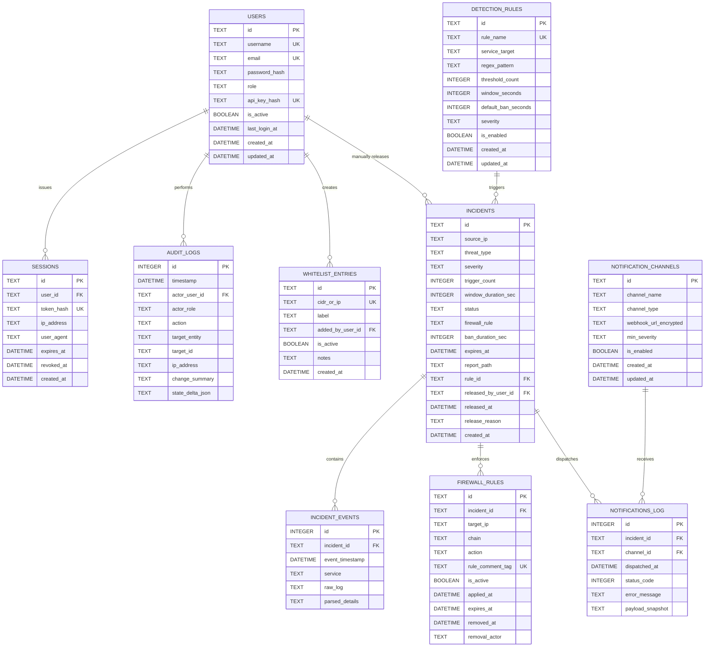

# Backend Database Schema & Data Architecture Specification

**Project Name:** SentinelBash — SOC Automation & Incident Response Engine  
**Document Version:** 1.0.0  
**Status:** Approved for Production Data Architecture  
**Role:** Senior Principal Backend & Database Architect  
**Companion Documents:** [PRD.md](file:///d:/SOC%20Automation/PRD.md) | [TRD.md](file:///d:/SOC%20Automation/TRD.md) | [APP_FLOW.md](file:///d:/SOC%20Automation/APP_FLOW.md)  

---

## 1. Architectural Overview & Storage Engine

The SentinelBash persistence tier is engineered to support high-throughput, low-latency concurrent writes from the Bash ingestion/containment engine while providing sub-millisecond query performance for the Analyst REST API and real-time dashboard.

### 1.1 Database Engine: SQLite3 (WAL Mode) with PostgreSQL Parity
- **Primary Single-Host Engine:** SQLite 3.38+ with **Write-Ahead Logging (`PRAGMA journal_mode=WAL;`)**, synchronous normal (`PRAGMA synchronous=NORMAL;`), and memory-mapped I/O (`PRAGMA mmap_size=268435456;`). This configuration supports unlimited concurrent readers and serialized microsecond writes without locking conflicts.
- **Enterprise Distributed Parity:** All DDL definitions are strictly standard SQL-compliant, enabling zero-friction migration to PostgreSQL 15+ if scaling to distributed multi-node clusters.

---

## 2. Entity-Relationship Diagram (ERD)



---

## 3. Detailed Data Dictionary & Schema Definitions

### 3.1 Table: `users`
Stores authenticated human operators and system daemon credentials.

```sql
CREATE TABLE IF NOT EXISTS users (
    id TEXT PRIMARY KEY,                                      -- UUIDv4 e.g. "usr_01J8F3K9M..."
    username TEXT NOT NULL UNIQUE,                            -- "admin", "analyst_jdoe"
    email TEXT NOT NULL UNIQUE,                               -- "jdoe@secops.internal"
    password_hash TEXT NOT NULL,                              -- Argon2id or bcrypt hash
    role TEXT NOT NULL CHECK(role IN ('ADMIN', 'ANALYST', 'AUDITOR', 'AUTOMATION_DAEMON')),
    api_key_hash TEXT UNIQUE,                                 -- SHA-256 hash of API key ("snt_live_...")
    is_active BOOLEAN NOT NULL DEFAULT 1,
    last_login_at DATETIME,
    created_at DATETIME NOT NULL DEFAULT CURRENT_TIMESTAMP,
    updated_at DATETIME NOT NULL DEFAULT CURRENT_TIMESTAMP
);

CREATE INDEX IF NOT EXISTS idx_users_username ON users(username);
CREATE INDEX IF NOT EXISTS idx_users_api_key_hash ON users(api_key_hash);
```

---

### 3.2 Table: `sessions`
Tracks active user web sessions, JWT refresh tokens, and device attribution.

```sql
CREATE TABLE IF NOT EXISTS sessions (
    id TEXT PRIMARY KEY,                                      -- UUIDv4 session identifier
    user_id TEXT NOT NULL,
    token_hash TEXT NOT NULL UNIQUE,                          -- SHA-256 hash of JWT refresh token
    ip_address TEXT NOT NULL,                                 -- Client IP from where session initiated
    user_agent TEXT,                                          -- Browser / CLI client User-Agent
    expires_at DATETIME NOT NULL,
    revoked_at DATETIME,                                      -- NULL if active; timestamp if logged out
    created_at DATETIME NOT NULL DEFAULT CURRENT_TIMESTAMP,
    FOREIGN KEY (user_id) REFERENCES users(id) ON DELETE CASCADE
);

CREATE INDEX IF NOT EXISTS idx_sessions_user ON sessions(user_id);
CREATE INDEX IF NOT EXISTS idx_sessions_token ON sessions(token_hash);
CREATE INDEX IF NOT EXISTS idx_sessions_active ON sessions(expires_at, revoked_at);
```

---

### 3.3 Table: `detection_rules`
Defines heuristic threat detection parameters and regex signatures.

```sql
CREATE TABLE IF NOT EXISTS detection_rules (
    id TEXT PRIMARY KEY,                                      -- e.g. "RULE_SSH_BRUTE_FORCE"
    rule_name TEXT NOT NULL UNIQUE,                           -- "SSH Brute Force Velocity"
    service_target TEXT NOT NULL,                             -- "auth.log", "nginx/access.log", "syslog"
    regex_pattern TEXT NOT NULL,                              -- Regex to match offending lines
    threshold_count INTEGER NOT NULL DEFAULT 5,               -- Number of matches to trigger
    window_seconds INTEGER NOT NULL DEFAULT 60,               -- Sliding evaluation window
    default_ban_seconds INTEGER NOT NULL DEFAULT 3600,        -- 3600 = 1 hour; 0 = Permanent
    severity TEXT NOT NULL CHECK(severity IN ('CRITICAL', 'HIGH', 'MEDIUM', 'LOW')),
    is_enabled BOOLEAN NOT NULL DEFAULT 1,
    created_at DATETIME NOT NULL DEFAULT CURRENT_TIMESTAMP,
    updated_at DATETIME NOT NULL DEFAULT CURRENT_TIMESTAMP
);
```

---

### 3.4 Table: `incidents`
Primary ledger for detected threats, automated defense executions, and resolutions.

```sql
CREATE TABLE IF NOT EXISTS incidents (
    id TEXT PRIMARY KEY,                                      -- Structured: "INC-YYYYMMDD-XXXX"
    source_ip TEXT NOT NULL,                                  -- Offending IPv4 / IPv6 address
    threat_type TEXT NOT NULL,                                -- "SSH_BRUTE_FORCE", "WEB_TRAVERSAL", etc.
    severity TEXT NOT NULL CHECK(severity IN ('CRITICAL', 'HIGH', 'MEDIUM', 'LOW')),
    trigger_count INTEGER NOT NULL,                           -- Number of observed malicious events
    window_duration_sec INTEGER NOT NULL,                     -- Actual window duration measured
    status TEXT NOT NULL CHECK(status IN (
        'CONTAINED',          -- Active firewall block in place
        'EXPIRED',            -- Ban duration elapsed; rule auto-removed
        'MANUALLY_RELEASED',  -- Operator manually unbanned IP
        'WHITELIST_BYPASS'    -- Threshold hit, but action skipped due to whitelist
    )),
    firewall_rule TEXT,                                       -- Exact command executed (e.g. "iptables -I INPUT...")
    ban_duration_sec INTEGER NOT NULL DEFAULT 3600,
    expires_at DATETIME,                                      -- Calculated: created_at + ban_duration_sec
    report_path TEXT NOT NULL,                                -- Filesystem path to Markdown dossier
    rule_id TEXT,                                             -- Rule that triggered incident
    released_by_user_id TEXT,                                 -- Operator who revoked ban
    released_at DATETIME,                                     -- When ban was manually revoked
    release_reason TEXT,                                      -- Operator's justification
    created_at DATETIME NOT NULL DEFAULT CURRENT_TIMESTAMP,
    FOREIGN KEY (rule_id) REFERENCES detection_rules(id) ON DELETE SET NULL,
    FOREIGN KEY (released_by_user_id) REFERENCES users(id) ON DELETE SET NULL
);

-- Compound and single-column performance indexes
CREATE INDEX IF NOT EXISTS idx_incidents_source_ip ON incidents(source_ip);
CREATE INDEX IF NOT EXISTS idx_incidents_status ON incidents(status);
CREATE INDEX IF NOT EXISTS idx_incidents_created_at ON incidents(created_at DESC);
CREATE INDEX IF NOT EXISTS idx_incidents_active_bans ON incidents(status, expires_at) 
    WHERE status = 'CONTAINED';
```

---

### 3.5 Table: `incident_events`
Stores chronological raw log lines extracted during the incident window for forensic replay.

```sql
CREATE TABLE IF NOT EXISTS incident_events (
    id INTEGER PRIMARY KEY AUTOINCREMENT,
    incident_id TEXT NOT NULL,
    event_timestamp DATETIME NOT NULL,
    service TEXT NOT NULL,                                    -- "sshd", "nginx"
    raw_log TEXT NOT NULL,                                    -- Exact raw line from system log
    parsed_details TEXT,                                      -- JSON blob with user, port, path, status
    FOREIGN KEY (incident_id) REFERENCES incidents(id) ON DELETE CASCADE
);

CREATE INDEX IF NOT EXISTS idx_incident_events_rel ON incident_events(incident_id, event_timestamp);
```

---

### 3.6 Table: `firewall_rules`
Tracks low-level kernel Netfilter/iptables rules to ensure 100% deterministic cleanup and avoid rule orphanages.

```sql
CREATE TABLE IF NOT EXISTS firewall_rules (
    id TEXT PRIMARY KEY,                                      -- "FW-YYYYMMDD-XXXX"
    incident_id TEXT,
    target_ip TEXT NOT NULL,
    chain TEXT NOT NULL DEFAULT 'INPUT',                      -- Netfilter chain: INPUT, FORWARD
    action TEXT NOT NULL DEFAULT 'DROP',                      -- DROP, REJECT
    rule_comment_tag TEXT NOT NULL UNIQUE,                    -- "SENTINEL:INC-20260919-8F32"
    is_active BOOLEAN NOT NULL DEFAULT 1,
    applied_at DATETIME NOT NULL DEFAULT CURRENT_TIMESTAMP,
    expires_at DATETIME,                                      -- NULL if permanent
    removed_at DATETIME,                                      -- Timestamp of unban
    removal_actor TEXT,                                       -- "DAEMON_TTL_EXPIRY" or "usr_..."
    FOREIGN KEY (incident_id) REFERENCES incidents(id) ON DELETE CASCADE
);

CREATE INDEX IF NOT EXISTS idx_firewall_ip ON firewall_rules(target_ip);
CREATE INDEX IF NOT EXISTS idx_firewall_active ON firewall_rules(is_active, expires_at);
```

---

### 3.7 Table: `whitelist_entries`
Stores static IP addresses and CIDR subnets that are strictly exempt from automated containment.

```sql
CREATE TABLE IF NOT EXISTS whitelist_entries (
    id TEXT PRIMARY KEY,                                      -- "WL-XXXX"
    cidr_or_ip TEXT NOT NULL UNIQUE,                          -- "127.0.0.1/8", "192.168.1.0/24"
    label TEXT NOT NULL,                                      -- "Corporate VPN Gateway"
    added_by_user_id TEXT,
    is_active BOOLEAN NOT NULL DEFAULT 1,
    notes TEXT,
    created_at DATETIME NOT NULL DEFAULT CURRENT_TIMESTAMP,
    FOREIGN KEY (added_by_user_id) REFERENCES users(id) ON DELETE SET NULL
);

CREATE INDEX IF NOT EXISTS idx_whitelist_active ON whitelist_entries(is_active);
```

---

### 3.8 Table: `notification_channels` & `notifications_log`
Manages alerting webhooks (Slack, Teams, Discord, Email) and maintains an auditable dispatch history.

```sql
CREATE TABLE IF NOT EXISTS notification_channels (
    id TEXT PRIMARY KEY,                                      -- "CHAN_SLACK_ALERTS"
    channel_name TEXT NOT NULL,                               -- "#soc-critical-alerts"
    channel_type TEXT NOT NULL CHECK(channel_type IN ('SLACK_WEBHOOK', 'TEAMS_WEBHOOK', 'EMAIL_SMTP', 'DISCORD_WEBHOOK')),
    webhook_url_encrypted TEXT NOT NULL,                      -- AES-256-GCM encrypted URL/token
    min_severity TEXT NOT NULL DEFAULT 'HIGH',                -- Filter threshold
    is_enabled BOOLEAN NOT NULL DEFAULT 1,
    created_at DATETIME NOT NULL DEFAULT CURRENT_TIMESTAMP,
    updated_at DATETIME NOT NULL DEFAULT CURRENT_TIMESTAMP
);

CREATE TABLE IF NOT EXISTS notifications_log (
    id INTEGER PRIMARY KEY AUTOINCREMENT,
    incident_id TEXT NOT NULL,
    channel_id TEXT NOT NULL,
    dispatched_at DATETIME NOT NULL DEFAULT CURRENT_TIMESTAMP,
    status_code INTEGER,                                      -- HTTP response (200, 429, 500)
    error_message TEXT,                                       -- NULL if success
    payload_snapshot TEXT NOT NULL,                           -- JSON payload sent
    FOREIGN KEY (incident_id) REFERENCES incidents(id) ON DELETE CASCADE,
    FOREIGN KEY (channel_id) REFERENCES notification_channels(id) ON DELETE CASCADE
);

CREATE INDEX IF NOT EXISTS idx_notifications_incident ON notifications_log(incident_id);
```

---

### 3.9 Table: `audit_logs`
Immutable compliance ledger recording all administrative, operator, and automated security modifications.

```sql
CREATE TABLE IF NOT EXISTS audit_logs (
    id INTEGER PRIMARY KEY AUTOINCREMENT,
    timestamp DATETIME NOT NULL DEFAULT CURRENT_TIMESTAMP,
    actor_user_id TEXT,                                       -- NULL if automated system daemon
    actor_role TEXT NOT NULL,                                 -- "ADMIN", "AUTOMATION_DAEMON"
    action TEXT NOT NULL,                                     -- "AUTO_CONTAIN", "MANUAL_UNBAN", "RULE_UPDATE"
    target_entity TEXT NOT NULL,                              -- "INCIDENT", "FIREWALL_RULE", "CONFIG"
    target_id TEXT,                                           -- Entity ID (e.g. "INC-20260919-8F32")
    ip_address TEXT,                                          -- Operator IP address
    change_summary TEXT NOT NULL,                             -- Human-readable description
    state_delta_json TEXT                                     -- Diff { "before": {...}, "after": {...} }
);

CREATE INDEX IF NOT EXISTS idx_audit_timestamp ON audit_logs(timestamp DESC);
CREATE INDEX IF NOT EXISTS idx_audit_target ON audit_logs(target_entity, target_id);
```

---

## 4. Authentication, Session & Key Architecture

### 4.1 Dual-Track Authentication
The backend supports two distinct authentication paths:
1. **Interactive Operator Authentication (JWT + Refresh Session):**
   - **Access Token:** Short-lived JWT (15-minute expiry) signed with HMAC-SHA256 (`HS256`).
   - **Refresh Token:** Cryptographically secure 256-bit random string stored in `sessions` table. Exchanged via `/api/v1/auth/refresh` with automatic token rotation.
2. **System & CLI API Key Authentication:**
   - Keys follow the format: `snt_live_[32_random_alphanumeric_chars]`.
   - Never stored in plaintext. Ingested keys are hashed using `SHA-256` and matched against `users.api_key_hash`.

### 4.2 Security Token Structure (JWT Claims)
```json
{
  "sub": "usr_01J8F3K9M2000000000000000",
  "username": "lead_analyst",
  "role": "ANALYST",
  "iss": "sentinel-bash-auth",
  "iat": 1789800000,
  "exp": 1789800900
}
```

---

## 5. Role-Based Access Control (RBAC) Matrix

| Permission String | Description | ADMIN | ANALYST | AUDITOR | AUTOMATION_DAEMON |
| :--- | :--- | :---: | :---: | :---: | :---: |
| `incidents:read` | View incident listings, timelines, and dossiers | ✅ | ✅ | ✅ | ✅ |
| `incidents:export` | Download CSV and JSON-L forensic reports | ✅ | ✅ | ✅ | ❌ |
| `containment:unban` | Manually release an active firewall block | ✅ | ✅ | ❌ | ❌ |
| `containment:block` | Manually quarantine an arbitrary IP | ✅ | ✅ | ❌ | ✅ |
| `containment:flush` | Flush all Sentinel netfilter rules | ✅ | ❌ | ❌ | ❌ |
| `rules:manage` | Create, update, or disable detection rules | ✅ | ❌ | ❌ | ❌ |
| `whitelist:manage` | Add or remove protected CIDRs | ✅ | ❌ | ❌ | ❌ |
| `audit:read` | View immutable administrative audit trail | ✅ | ❌ | ✅ | ❌ |
| `simulator:run` | Execute synthetic attack simulations | ✅ | ✅ | ❌ | ❌ |

---

## 6. Data Ownership, Immutability & Lifecycle Governance

### 6.1 Strict Data Immutability Rules
1. **Append-Only Forensic Logs:** Records in `audit_logs`, `incident_events`, and `notifications_log` are **strictly append-only**. Database triggers and application code prohibit `UPDATE` or `DELETE` operations on these tables.
2. **Dossier Integrity:** The markdown file referenced in `incidents.report_path` is written with read-only file permissions (`chmod 400`) upon incident conclusion to prevent post-event tampering.

### 6.2 Data Retention & Pruning Strategy
- **Active Incidents & Bans:** Retained indefinitely in SQLite.
- **Raw Incident Events (`incident_events`):** High-volume raw lines pruned after 90 days via an automated scheduled retention task (`sentinel-db-cleaner.service`).
- **Audit Logs:** Retained for a minimum of 365 days to comply with standard security audit policies (SOC 2, ISO 27001).

```sql
-- Automated 90-day pruning query for raw log events:
DELETE FROM incident_events 
WHERE event_timestamp < datetime('now', '-90 days')
  AND incident_id IN (
      SELECT id FROM incidents WHERE status IN ('EXPIRED', 'MANUALLY_RELEASED')
  );
```

