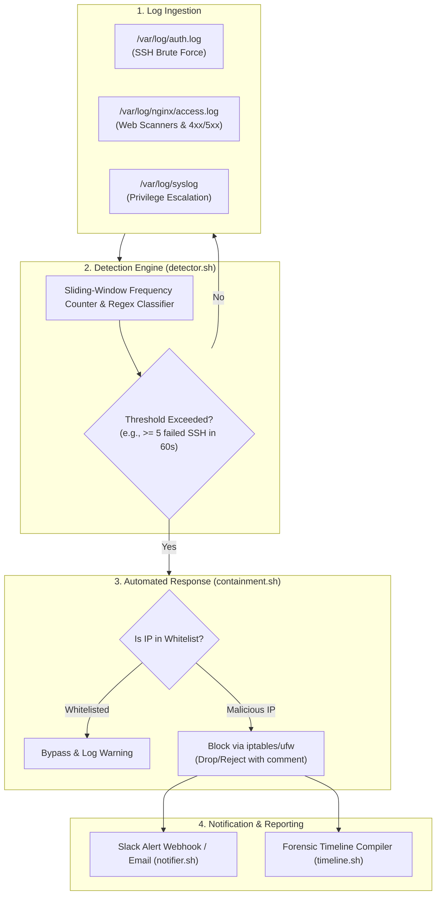

# Product Requirements Document (PRD)

**Project Name:** SentinelBash — Bash-Driven Mini-SOC Automation & Incident Response Engine  
**Document Version:** 1.0.0  
**Status:** Approved for Implementation  
**Author:** Senior Technical Product Manager, SecOps & Automation  
**Target Release:** MVP v0.1.0  

---

## 1. Executive Summary & Overview

Modern Security Operations Centers (SOCs) face overwhelming alert fatigue, delayed Mean Time to Detect (MTTD), and repetitive manual response tasks for common attack patterns (e.g., brute force, SSH unauthorized access, web scanning, and endpoint anomalies).

**SentinelBash** is a lightweight, zero-bloat, modular Bash-driven SOC automation tool designed to emulate an enterprise SIEM + SOAR (Security Orchestration, Automation, and Response) pipeline on Linux systems. It ingests system logs in real time, applies configurable heuristic detection rules, automatically enforces IP containment via native Linux firewalls (`iptables` / `ufw`), dispatches instant alerts to incident responders via Slack webhooks or email, and compiles forensic incident timelines.

Beyond production utility for small-scale Linux deployments, SentinelBash demonstrates an end-to-end understanding of Tier-1/Tier-2 SOC workflows, detection engineering, and incident triage automation.

---

## 2. Target Users & Personas

| Persona | Role & Context | Pain Points & Needs |
| :--- | :--- | :--- |
| **SOC Analyst Tier 1 / Junior IR** | Monitors alerts, triages suspicious log anomalies, and verifies brute-force events. | Needs structured alert context and chronological incident timelines without digging through megabytes of raw syslog. |
| **SecOps / DevSecOps Engineer** | Manages cloud VPS instances and standalone Linux servers. | Wants automated, native host-level intrusion prevention without the heavy resource footprint of enterprise SIEM agents (Wazuh, Splunk, Elastic). |
| **Cybersecurity Student / Portfolio Builder** | Developing demonstrable skills for SOC Analyst / Threat Detection interviews. | Needs clean, documented, modular code that reflects real-world blue-team procedures (NIST SP 800-61 Incident Handling lifecycle). |

---

## 3. Problem Statement

1. **Slow Mean Time to Remediate (MTTR):** Unmitigated SSH brute-force and web application exploit scans often persist for hours before human analysts review logs and apply firewall blocks manually.
2. **Resource-Heavy Tooling:** Enterprise SIEM and EDR solutions consume considerable CPU, memory, and licensing overhead, making them impractical for bare-metal VPS, lab environments, or edge Linux machines.
3. **Fragmented Incident Documentation:** When an incident occurs, analysts waste critical time reconstructing the attacker's timeline across multiple disjointed log files (`/var/log/auth.log`, `/var/log/nginx/access.log`, etc.).

---

## 4. Product Goals & Non-Goals

### 4.1 Goals
- **Real-Time Continuous Ingestion:** Stream and parse standard Linux logs with zero polling delay using native event streaming (`tail -F`).
- **Heuristic Rule-Based Threat Detection:** Detect brute-force thresholds, unauthorized privilege escalations, and malicious HTTP probes.
- **Automated Containment (SOAR):** Dynamically isolate attacker IPs using native Linux packet filters (`iptables` / `ufw`) with strict whitelist protections.
- **Rich Multi-Channel Alerting:** Transmit JSON-formatted security alerts to team collaboration channels (Slack webhooks) and fallback notification channels (Email/Syslog).
- **Automated Incident Timeline Generation:** Compile an auditable, timestamped forensic record in Markdown/JSON for every containment event.
- **Portability & Zero Heavy Dependencies:** Run out-of-the-box on standard Debian/Ubuntu/RHEL distributions using standard POSIX/Bash utilities (`awk`, `sed`, `grep`, `iptables`, `curl`).

### 4.2 Non-Goals (Out of Scope for MVP)
- Distributed cross-host cluster correlation (MVP is single-host / standalone engine).
- Machine learning or behavioral anomaly scoring (rule-based heuristic thresholds will be used).
- Full-fledged web GUI dashboard (focus is on CLI interface, structured reports, and Slack/Discord feeds).

---

## 5. Core Features & System Architecture



### 5.1 Real-Time Log Ingestion (`ingestor.sh`)
- Tails designated system log streams concurrently using non-blocking subshells or named pipes (FIFOs).
- Normalizes distinct log formats into a common schema:
  `[TIMESTAMP] [SOURCE_SERVICE] [SOURCE_IP] [EVENT_TYPE] [PAYLOAD/DETAILS]`

### 5.2 Threat Detection Engine (`detector.sh`)
- **SSH Brute-Force Module:** Detects repeated `Failed password` or `Invalid user` entries exceeding threshold $N$ within interval $T$ (default: 5 failures within 60s).
- **Web Application Reconnaissance Module:** Identifies repeated 404s, path traversal attempts (`../`, `/etc/passwd`), or web shell scanning (`phpmyadmin`, `.env`, `.git`).
- **Privilege Escalation Monitor:** Flags unauthorized `sudo` attempts and unexpected user group modifications.

### 5.3 Automated Containment Engine (`containment.sh`)
- Automatic rule insertion into `iptables` or `ufw` targeting offending IP addresses.
- **Fail-Safe Whitelisting:** Mandates validation against a protected whitelist (`127.0.0.1`, RFC 1918 private subnets, configured admin IPs) to prevent accidental self-lockout.
- **Timed Auto-Unban (Lease Mechanism):** Optional temporary ban TTL (e.g., 3600 seconds) with automated rule pruning to prevent bloated firewall tables.

### 5.4 Notification Dispatcher (`notifier.sh`)
- Formatted Slack Webhook payloads with color-coded severity tiers:
  - 🔴 **CRITICAL:** Automated IP isolation triggered.
  - 🟡 **HIGH:** Privilege escalation or suspicious command execution.
  - 🔵 **INFO:** Tool health, daily status digest, rule updates.
- Fallback to local mail transfer agent (`mailx`/`sendmail`) or local security event log.

### 5.5 Incident Forensics & Timeline Creation (`timeline.sh`)
- Automatically captures surrounding log context ($T - 10\text{m}$ to $T + 2\text{m}$) for the offending IP.
- Exports an incident report file: `/var/log/sentinel/incidents/INC-<TIMESTAMP>-<IP>.md`.
- Generates a chronological Markdown table detailing:
  - Initial discovery timestamp
  - Sequence of observed attempts
  - Rule trigger threshold
  - Firewall execution time and rule reference
  - Notification delivery status

---

## 6. User Stories & Acceptance Criteria

### User Story 1: SSH Brute Force Detection & Auto-Containment
> **As a** SOC Analyst / System Administrator,  
> **I want** the system to detect repeated failed SSH login attempts from an IP and block it immediately,  
> **So that** brute-force actors are neutralized before compromising user credentials.

- **Given** an external IP `203.0.113.45` generates 5 failed SSH authentication attempts within 60 seconds,
- **When** the detection engine parses the 5th event,
- **Then** it should invoke `containment.sh`, append an `iptables` drop rule for `203.0.113.45`, verify the block in `< 500ms`, and append the event to the active incident queue.

### User Story 2: Fail-Safe Whitelisting
> **As a** DevOps Engineer,  
> **I want** internal subnets and corporate VPN IPs to be strictly whitelisted,  
> **So that** automated containment never disrupts authorized team operations or administrative sessions.

- **Given** an administrator IP `192.168.1.50` configured in `whitelist.conf`,
- **When** 10 erroneous failed authentication events are recorded for this IP,
- **Then** the containment module must abort firewall enforcement, log a `WHITELIST_BYPASS_WARNING`, and notify the admin channel without blocking.

### User Story 3: Slack Incident Alerting
> **As an** On-Call Responder,  
> **I want** an instant Slack message containing incident telemetry when a containment event occurs,  
> **So that** I can review the action on my mobile or desktop without logging into the server.

- **Given** a successful IP containment action,
- **When** the notifier module is triggered,
- **Then** a Slack webhook POST request is dispatched with JSON payload containing: Event ID, Attacker IP, Attack Type, Trigger Count, Action Taken, and a snippet of offending logs.

### User Story 4: Post-Incident Forensic Timeline
> **As an** Incident Handler,  
> **I want** an automatically generated Markdown incident timeline,  
> **So that** I have instant compliance and forensic documentation ready for post-mortem analysis.

- **Given** an IP block action has completed,
- **When** `timeline.sh` executes,
- **Then** a clean Markdown report is authored containing an executive summary, chronological log table, and remediation confirmation, saved to `/var/log/sentinel/incidents/`.

---

## 7. MVP Scope vs. Future Roadmap (MoSCoW)

| Category | Features |
| :--- | :--- |
| **Must Have (MVP)** | - Real-time monitoring of `/var/log/auth.log` (or OS equivalent).<br>- SSH brute force detection rule (customizable count & timeframe).<br>- `iptables`/`ufw` auto-block execution with duplicate-rule check.<br>- Static IP whitelist verification.<br>- Slack Webhook notifications with JSON payload.<br>- Markdown incident report generation per blocked IP.<br>- Centralized configuration file (`sentinel.conf`). |
| **Should Have (v1.1)** | - Web server log inspection (`nginx`/`apache` 404 scanning & directory traversal).<br>- Timed unban mechanism (sliding lease time via cron or sleep subprocess).<br>- Email notification support via standard `mailx`.<br>- Manual CLI operator commands (`sentinel --status`, `sentinel --unban <IP>`). |
| **Could Have (v1.2)** | - AbuseIPDB / VirusTotal API integration for threat intelligence enrichment.<br>- Discord and Microsoft Teams webhook adapters.<br>- System load auto-throttle to cap CPU usage during high-velocity log storms.<br>- Export incident records to JSON-L for ingestion into central cold storage. |
| **Won't Have (MVP)** | - Web-based graphical UI.<br>- Machine learning or statistical user-behavior models.<br>- Multi-node centralized aggregation (elastic cluster mode). |

---

## 8. Technical & Functional Specifications

### 8.1 Configuration Specification (`sentinel.conf`)
```bash
# SentinelBash Configuration
LOG_MONITOR_TARGET="/var/log/auth.log"
SSH_FAIL_THRESHOLD=5
TIME_WINDOW_SECONDS=60
FIREWALL_BACKEND="iptables"   # Options: iptables, ufw
AUTO_BLOCK_ENABLED=true
BAN_DURATION_SECONDS=3600    # 0 for permanent
WHITELIST_FILE="/etc/sentinel/whitelist.conf"
SLACK_WEBHOOK_URL="https://hooks.slack.com/services/XXX/YYY/ZZZ"
ALERT_EMAIL="soc-alerts@example.com"
REPORT_DIR="/var/log/sentinel/incidents"
```

### 8.2 File & Directory Structure
```text
sentinel/
├── bin/
│   ├── sentinel.sh           # Main orchestrator daemon
│   ├── ingestor.sh           # Stream parser & normalizer
│   ├── detector.sh           # Heuristic rule evaluation
│   ├── containment.sh        # Firewall interaction & whitelist check
│   ├── notifier.sh           # Slack / Email webhook dispatcher
│   └── timeline.sh           # Markdown incident report builder
├── config/
│   ├── sentinel.conf         # Global configuration settings
│   └── whitelist.conf        # Protected CIDR ranges & IP addresses
├── tests/
│   ├── simulate_attack.sh    # Simulation tool to generate attack traffic
│   └── run_tests.sh          # Automated unit & integration test harness
└── README.md                 # Setup, verification, and architecture guide
```

### 8.3 Error Handling & Edge Cases
1. **Log Rotation Handling:** Must use `tail -F` (with retry on inode change) rather than `tail -f` so that logrotate events do not sever log streaming.
2. **Race Condition Prevention:** Multiple failed attempts arriving in rapid succession must be serialized using lockfiles (`flock`) to avoid redundant firewall rule insertion or duplicate alerts.
3. **Network Failure on Alert Dispatch:** If the Slack webhook fails or times out, the alert must be spooled locally in `/var/log/sentinel/alert_spool.log` and retried, ensuring zero alert loss.

---

## 9. Success Metrics & Key Performance Indicators (KPIs)

| Metric | Target (MVP) | Measurement Method |
| :--- | :--- | :--- |
| **Mean Time to Detect (MTTD)** | $< 3\text{ seconds}$ from log entry generation | Timestamp delta: Log emission timestamp vs. Rule match timestamp |
| **Mean Time to Remediate (MTTR)** | $< 2\text{ seconds}$ from detection to firewall block | Timestamp delta: Rule trigger vs. `iptables` rule application |
| **Alert Dispatch Latency** | $< 3\text{ seconds}$ post-containment | Time between firewall rule commit and HTTP 200 from Slack webhook |
| **False Positive Containment Rate** | 0% for whitelisted targets | Integration tests with simulated internal failures |
| **System Resource Footprint** | $< 1.5\%\text{ CPU}$ and $< 30\text{MB RAM}$ in idle/monitoring state | Continuous sampling via `ps` / `top` during standard operations |
| **Setup & Deployment Time** | $< 5\text{ minutes}$ on a fresh Ubuntu LTS host | One-command installer execution and self-check validation |

---

## 10. Security, Privacy & Reliability Considerations

1. **Least Privilege & Sudo Rights:** While `iptables`/`ufw` commands require elevated privileges, the detection and parsing modules should ideally run under an unprivileged `sentinel` system user, invoking specific containment scripts via strict `/etc/sudoers.d/sentinel` rules.
2. **Webhook & Credential Security:** The `sentinel.conf` file containing sensitive webhook tokens must have strict file permissions (`chmod 600`, owned by `root`).
3. **Denial-of-Service / Log Bomb Defense:** In the event of an adversary flooding auth logs with random spoofed IPs, the containment module must implement an hourly threshold cap to prevent saturating the kernel's netfilter table.
4. **Clean Uninstall & Firewall Recovery:** An uninstallation script (`uninstall.sh`) must cleanly flush only rules tagged with `# SentinelBash-Managed` without dismantling the host's existing firewall configuration.

---

## 11. Verification & Test Plan

1. **Unit Verification:**
   - Test log parsing logic against raw sample log files containing varied formats (OpenSSH 7.x vs 8.x vs 9.x).
   - Test whitelist validator against single IPs, subnets (`192.168.0.0/24`), and loopback addresses.
2. **End-to-End Simulation Testing:**
   - Execute `simulate_attack.sh` generating controlled brute-force attacks against `localhost`.
   - Verify:
     1. Offending IP is identified within 3 seconds.
     2. `iptables -L -n` reflects new drop rule with custom comment tag.
     3. Slack channel receives formatted alert card with payload details.
     4. Incident Markdown report is compiled in `/var/log/sentinel/incidents/`.
3. **Resilience Testing:**
   - Trigger `logrotate --force /etc/logrotate.d/rsyslog` and verify Sentinel continues ingestion seamlessly.

