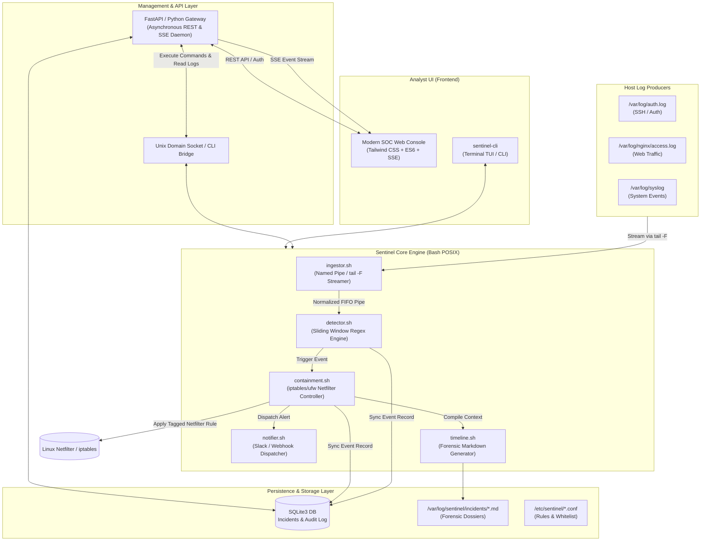
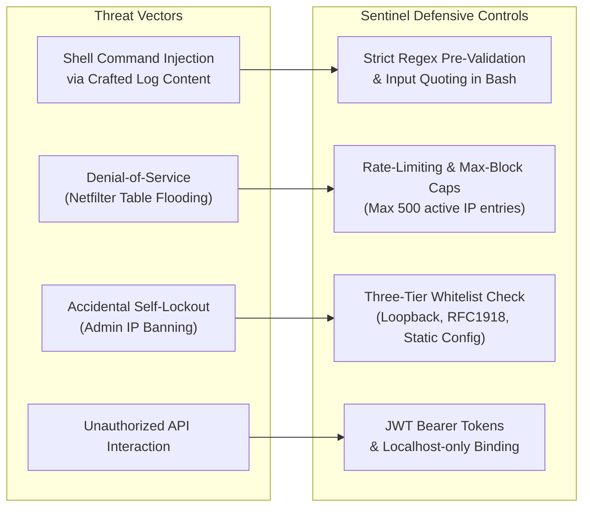

# Technical Requirements Document (TRD)

**Project Name:** SentinelBash — Mini-SOC Automation & Incident Response Platform  
**Document Version:** 1.0.0  
**Status:** Approved for Architecture & Implementation  
**Lead Architect:** Senior Principal Security Systems Architect  
**Companion Document:** [PRD.md](file:///d:/SOC%20Automation/PRD.md)  

---

## 1. Executive Technical Summary & System Objectives

SentinelBash is an event-driven, host-level Security Operations Center (SOC) emulation and automation platform. The system couples a zero-overhead, deterministic **Bash/POSIX core engine** for real-time log ingestion, threat detection, and kernel packet-filter containment with a **lightweight asynchronous backend API and analyst dashboard** for live incident telemetry, interactive quarantine management, and forensic review.

### Primary Engineering Objectives
- **Sub-Second Response Latency:** Detection-to-containment cycle (Mean Time to Remediate - MTTR) $\le 2.0\text{s}$.
- **Zero Kernel Pollution:** Strict tagged firewall state tracking ensuring 100% clean rule insertion and revocation.
- **Resource Discipline:** $\le 35\text{MB}$ RAM baseline footprint; $\le 2\%$ CPU utilization during idle log ingestion.
- **Defensive Resilience:** Strict whitelist immunity to prevent self-denial-of-service (DoS) or operator lockout.

---

## 2. System Architecture & Component Model

### 2.1 High-Level Architecture Diagram



### 2.2 Component Breakdown & Data Flow

1. **Ingestion Pipeline (`ingestor.sh`):**
   - Continuously monitors targets using `tail -n 0 -F` to handle log-rotation seamlessly.
   - Normalizes raw unstructured log strings into standardized JSON-L / TSV streams written to a Unix Named Pipe (FIFO) at `/run/sentinel/log.fifo`.

2. **Detection Core (`detector.sh`):**
   - Reads from `/run/sentinel/log.fifo` in an unbuffered streaming loop.
   - Maintains memory-backed sliding-window frequency tables using Bash associative arrays and epoch timestamps.
   - Evaluates signature rules against attack patterns (brute force, directory traversal, unauthorized `sudo`).

3. **Containment Controller (`containment.sh`):**
   - Validates candidate target IP against `whitelist.conf` (IPs, CIDRs, loopback).
   - Checks kernel netfilter state via `iptables -C` or `ipset test` to prevent duplicate rules.
   - Injects tagged drop rules using `-m comment --comment "SENTINEL:<INC_ID>"`.
   - Schedules temporary lease unban tasks via `at` daemon or background timer subshell.

4. **Forensics & Reporting (`timeline.sh`):**
   - Queries historical log lines around trigger timestamp ($T - 10\text{m}$ to $T + 2\text{m}$).
   - Emits structured, timestamped Markdown dossiers to `/var/log/sentinel/incidents/INC-<ID>.md`.
   - Inserts immutable incident summaries into the SQLite database.

5. **API & Operator Daemon:**
   - Lightweight asynchronous Python (FastAPI) daemon operating over localhost (`127.0.0.1:8080`) or Unix Domain Socket.
   - Bridges UI/CLI operator actions (unban, override, re-scan) to the Bash engine via restricted subcommands.
   - Streams live logs and incident events to the web console via Server-Sent Events (SSE).

---

## 3. Technology Stack Selection & Specifications

| Layer | Technology | Version | Rationale & Justification |
| :--- | :--- | :--- | :--- |
| **Core Automation Engine** | GNU Bash / POSIX Shell | 5.0+ | Native execution on every Linux distribution with zero runtimes, compilers, or heavy interpreter overhead. Immediate access to system utilities. |
| **Kernel Firewall Interface** | `iptables` / `ipset` / `ufw` | Standard Linux | Direct kernel packet filtering via Netfilter. `ipset` provides $O(1)$ set lookup for blocking thousands of IPs without degrading network throughput. |
| **Stream Processing** | GNU Coreutils (`tail`, `awk`, `grep`, `sed`) | Coreutils 8.30+ | Highly optimized C binaries for low-latency line streaming and regex parsing. |
| **Storage (Database)** | SQLite3 | 3.35+ | Serverless, zero-configuration, single-file ACID transactional database. Ideal for single-node SOC logging, audit trails, and fast indexed queries. |
| **Backend API Gateway** | Python 3.10+ (FastAPI + Uvicorn) | FastAPI $\ge$ 0.110 | Asynchronous non-blocking I/O natively supporting Server-Sent Events (SSE) for real-time live log feeds, OpenAPI autogeneration, and minimal RAM footprint ($\sim 25\text{MB}$). |
| **Frontend Stack** | HTML5, Modern ES6+, Tailwind CSS (CDN/Vanilla) | Current standards | Zero build-step requirement, instant loading, rich dark-mode SOC aesthetics, lightweight reactive DOM updates via SSE, zero node_modules production bloat. |
| **Inter-Process Comm.** | POSIX FIFOs & Unix Domain Sockets | OS Native | IPC latency under $10\mu\text{s}$; strictly local kernel-managed message passing. |
| **Service Supervisor** | Linux `systemd` | systemd 240+ | Native Linux service isolation, restart-on-failure, journald log aggregation, and cgroup resource quotas. |

---

## 4. Database Schema & Persistence

SQLite3 is deployed at `/var/lib/sentinel/sentinel.db`. Two primary tables govern state and auditing:

### 4.1 Schema Definition

```sql
-- Table: incidents
CREATE TABLE IF NOT EXISTS incidents (
    id TEXT PRIMARY KEY,                       -- e.g. "INC-20260919-8F32"
    timestamp DATETIME DEFAULT CURRENT_TIMESTAMP,
    source_ip TEXT NOT NULL,
    threat_type TEXT NOT NULL,                 -- "SSH_BRUTE_FORCE", "WEB_PROBE", "SUDO_ABUSE"
    trigger_count INTEGER NOT NULL,
    window_duration_sec INTEGER NOT NULL,
    status TEXT CHECK(status IN ('CONTAINED', 'EXPIRED', 'MANUALLY_RELEASED', 'WHITELIST_BYPASS')),
    firewall_rule TEXT,                        -- e.g. "iptables -I INPUT -s 203.0.113.45 -j DROP"
    ban_duration_sec INTEGER DEFAULT 3600,
    expires_at DATETIME,
    report_path TEXT NOT NULL                  -- Path to Markdown report
);

CREATE INDEX IF NOT EXISTS idx_incidents_ip ON incidents(source_ip);
CREATE INDEX IF NOT EXISTS idx_incidents_timestamp ON incidents(timestamp);

-- Table: audit_log
CREATE TABLE IF NOT EXISTS audit_log (
    log_id INTEGER PRIMARY KEY AUTOINCREMENT,
    timestamp DATETIME DEFAULT CURRENT_TIMESTAMP,
    actor TEXT NOT NULL,                       -- "SYSTEM_DAEMON" or "admin_user"
    action TEXT NOT NULL,                      -- "AUTO_BAN", "MANUAL_UNBAN", "RULE_UPDATE"
    target_ip TEXT,
    details TEXT
);
```

---

## 5. API Design & Endpoint Specifications

The Management Daemon exposes an OpenAPI-compliant REST API on `http://127.0.0.1:8080/api/v1` protected via Bearer Token authentication.

### 5.1 Endpoints Specification

| Method | Endpoint | Description | Request Body / Query | Response Code & Payload |
| :--- | :--- | :--- | :--- | :--- |
| `GET` | `/api/v1/health` | Service health & daemon status | None | `200 OK` `{ "status": "active", "uptime": 86400, "active_blocks": 12 }` |
| `GET` | `/api/v1/incidents` | List incident history with pagination | `?page=1&limit=25&threat_type=SSH_BRUTE_FORCE` | `200 OK` `[ { "id": "INC-...", "source_ip": "...", ... } ]` |
| `GET` | `/api/v1/incidents/{id}` | Fetch specific incident details & raw timeline | None | `200 OK` `{ "incident": {...}, "timeline_markdown": "..." }` |
| `POST` | `/api/v1/containment/block` | Manual emergency IP containment | `{ "ip": "198.51.100.2", "reason": "Threat Hunt", "duration": 7200 }` | `201 Created` `{ "incident_id": "...", "status": "CONTAINED" }` |
| `POST` | `/api/v1/containment/unban` | Revoke active firewall ban | `{ "ip": "198.51.100.2", "reason": "False Positive Verified" }` | `200 OK` `{ "status": "RELEASED", "ip": "198.51.100.2" }` |
| `GET` | `/api/v1/stream/logs` | Real-time live log stream via SSE | `?filter=auth` | `200 OK` `text/event-stream` with normalized log chunks |
| `GET` | `/api/v1/stream/alerts` | Real-time security alerts via SSE | None | `200 OK` `text/event-stream` with newly triggered incidents |

---

## 6. Authentication, Authorization & Access Control

### 6.1 API & Dashboard Authentication
- **Token Format:** Cryptographically signed JSON Web Tokens (JWT, HMAC-SHA256) with 8-hour expiry.
- **Header:** `Authorization: Bearer <TOKEN>`.
- **Secret Management:** Master signing key stored at `/etc/sentinel/jwt.secret` (permissions `0400`, owned by `root`).

### 6.2 Role-Based Access Control (RBAC)
- **`Role: Admin`**: Full access to view telemetry, issue manual bans, unban IPs, reload detection rules, and configure webhooks.
- **`Role: Analyst`**: Read access to alerts, log streams, and forensic incident dossiers; can add investigative notes.
- **`Role: Auditor`**: Read-only access to `/api/v1/incidents` and `/api/v1/audit_log`.

---

## 7. Security Architecture & Threat Modeling



### 7.1 Key Safeguards & Hardening Specifications

1. **Shell Injection Prevention:**
   - No untrusted strings from log lines (such as HTTP User-Agents or usernames) are ever passed unescaped to `eval` or shell execution strings.
   - All IP targets are validated against an RFC-compliant IPv4/IPv6 regex validator before passing to network commands:
     ```bash
     validate_ip() {
         local ip="$1"
         if [[ ! "$ip" =~ ^([0-9]{1,3}\.){3}[0-9]{1,3}$ ]]; then
             return 1
         fi
     }
     ```
2. **Whitelisting Immunity Engine:**
   - Any IP matching the following is strictly immune from automated drop actions:
     - Loopback (`127.0.0.0/8`, `::1`)
     - Configured Management CIDRs (`whitelist.conf`)
     - Default Gateway and Active SSH Connection IP (discovered dynamically via `who am i` / `SSH_CLIENT` environment).
3. **Privilege Separation via Sudoers:**
   - The daemon runs under an unprivileged system user `sentinel`.
   - Only `containment.sh` has targeted sudo permissions configured via `/etc/sudoers.d/sentinel`:
     ```text
     sentinel ALL=(root) NOPASSWD: /usr/local/bin/sentinel-containment
     ```

---

## 8. Deployment Plan & Operational Lifecycle

### 8.1 Systemd Service Architecture
The platform operates as a coordinated systemd multi-unit service:
- `sentinel-engine.service`: Ingestion, detection, containment daemons.
- `sentinel-api.service`: FastAPI management and SSE stream server.

```ini
# /etc/systemd/system/sentinel-engine.service
[Unit]
Description=SentinelBash Core SOC Automation Engine
After=network.target syslog.target
Wants=network-online.target

[Service]
Type=simple
User=root
ExecStart=/opt/sentinel/bin/sentinel.sh --daemon
Restart=always
RestartSec=5s
KillMode=process
StandardOutput=journal
StandardError=journal
AmbientCapabilities=CAP_NET_ADMIN CAP_NET_RAW

[Install]
WantedBy=multi-user.target
```

### 8.2 Directory Layout & Filesystem Permissions
```text
/opt/sentinel/
├── bin/
│   ├── sentinel.sh           # Main daemon lifecycle manager (rwxr-xr-x)
│   ├── ingestor.sh           # Stream log listener (rwxr-xr-x)
│   ├── detector.sh           # Threat classification logic (rwxr-xr-x)
│   ├── containment.sh        # Netfilter firewall execution (rwx------)
│   ├── notifier.sh           # Alert dispatcher (rwxr-xr-x)
│   └── timeline.sh           # Forensic dossier author (rwxr-xr-x)
/etc/sentinel/
├── sentinel.conf             # Main config (rw------- root:root)
├── whitelist.conf            # Protected IPs/Subnets (rw-r--r-- root:root)
└── jwt.secret                # Encryption key for API (r-------- sentinel:sentinel)
/var/log/sentinel/
├── sentinel.log              # Internal engine diagnostic log
├── alert_spool.log           # Offline retry queue for webhooks
└── incidents/                # Incident Markdown dossiers
    └── INC-20260919-*.md
/var/lib/sentinel/
└── sentinel.db               # SQLite database (rw-rw---- sentinel:sentinel)
/run/sentinel/
└── log.fifo                  # In-memory IPC pipe
```

### 8.3 Automated Installation & Provisioning (`install.sh`)
A single idempotent Bash installer script executes:
1. Prerequisite verification (`bash >= 5.0`, `iptables` / `ufw`, `sqlite3`, `curl`, `python3`).
2. System user creation (`sentinel` system user with `nologin`).
3. Directory hierarchy creation and strict POSIX permission hardening (`chmod 700 / 600`).
4. Systemd unit registration, daemon reload, and service enablement.

---

## 9. Architectural Decision Records (ADRs)

### ADR 01: Bash as the Core Detection & Ingestion Engine
- **Status:** Approved.
- **Context:** The product requires a zero-dependency, ultra-lightweight footprint capable of running on minimal 512MB RAM cloud VPS hosts without requiring JVM, Node, or heavy runtime setups.
- **Decision:** Implement stream processing and firewall automation in pure GNU Bash utilizing native coreutils (`awk`, `sed`, `grep`, `tail -F`).
- **Consequences:** Near-instant boot time ($< 100\text{ms}$), minimal memory usage ($< 25\text{MB}$), zero packaging/transitive dependency security vulnerabilities. Requires strict discipline regarding regex validation and string sanitization.

### ADR 02: SQLite3 for Incident Tracking and State Persistence
- **Status:** Approved.
- **Context:** A persistent data store is needed to track active bans, query historical incident data, and log operator audits.
- **Decision:** Use SQLite3 with Write-Ahead Logging (WAL) enabled over an external database server (e.g., PostgreSQL / MySQL).
- **Consequences:** Eliminates external daemon operational maintenance and memory footprint. Supports high-concurrency local reads and serialized writes which fit host-level SOC workloads cleanly.

### ADR 03: Tagged Netfilter Comments for Containment State Tracking
- **Status:** Approved.
- **Context:** Automated firewall modifications risk interfering with existing server firewall rules or lingering indefinitely after unbans.
- **Decision:** Require all firewall insertions to include an explicit comment tag: `-m comment --comment "SENTINEL:<INCIDENT_ID>"`.
- **Consequences:** Allows deterministic, safe querying (`iptables -S | grep SENTINEL`) and atomic cleanup without risking disruption to native hosting or docker firewall configurations.

### ADR 04: Server-Sent Events (SSE) over WebSockets for Analyst Dashboard
- **Status:** Approved.
- **Context:** Real-time log streaming and instant notification delivery to the web UI are required.
- **Decision:** Utilize unidirectional HTTP/2 Server-Sent Events (SSE) instead of bidirectional WebSockets.
- **Consequences:** Simpler protocol natively supported by standard HTTP proxies and browsers via `EventSource`. Automatic reconnection handling out-of-the-box, lower protocol complexity on the Python gateway.

---

## 10. Verification, Automated Testing & CI/CD Strategy

1. **Static Analysis & Linting:**
   - ShellCheck verification on all shell scripts: `shellcheck -x -e SC1091 bin/*.sh`.
   - Python code compliance: `ruff check` and `mypy` for backend API modules.
2. **Deterministic Attack Simulation Harness (`tests/simulate_attack.sh`):**
   - Automatically injects synthesized failed authentication lines into a temporary mock log stream.
   - Asserts:
     1. Event parsed within 500ms.
     2. Netfilter mock/rule registered with proper comment tag.
     3. Incident dossier created with non-zero byte count.
     4. Database row created with status `CONTAINED`.
3. **Containerized Smoke Test (`Dockerfile.test`):**
   - Runs integration suite inside an isolated Docker container with `CAP_NET_ADMIN` to test actual `iptables` rule creation without affecting host operating system.

